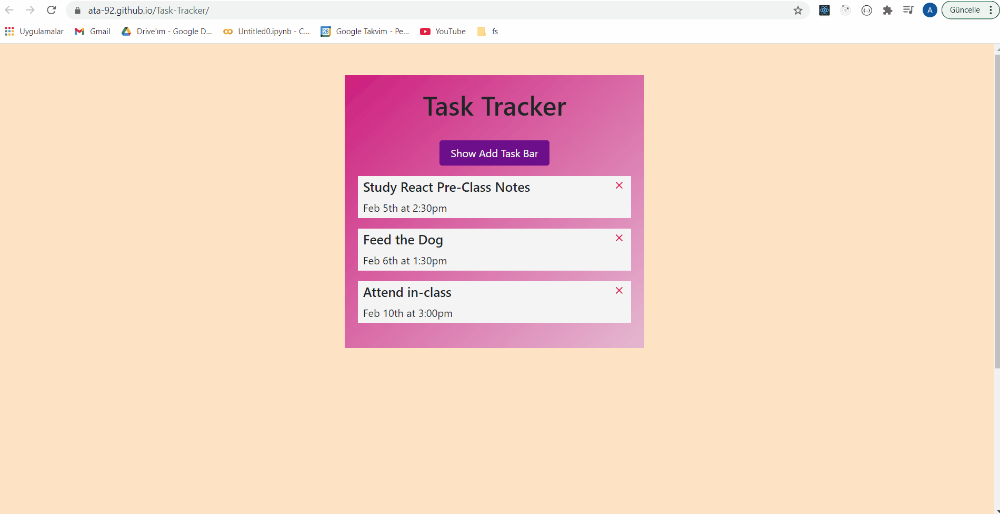

# Task Tracker

👉 After cloning and installing app, run **yarn run server** command on another terminal in addition to yarn start

👉 [Task Tracker Website](https://ata-92.github.io/Task-Tracker/)

👉 You can also take a look at [Heroku](https://ata-task-tracker.herokuapp.com/)

## My Outcome

